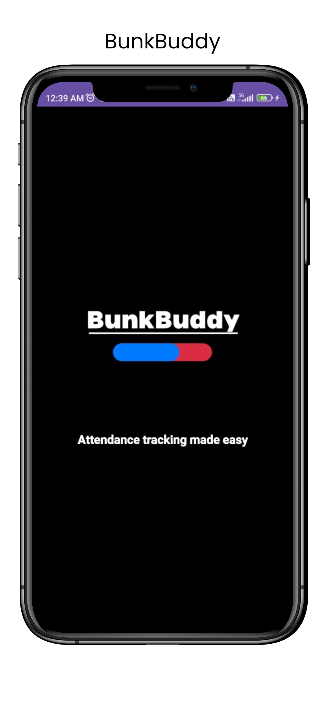
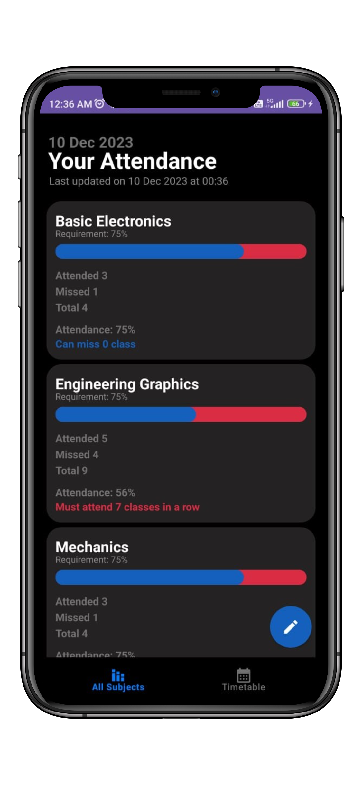
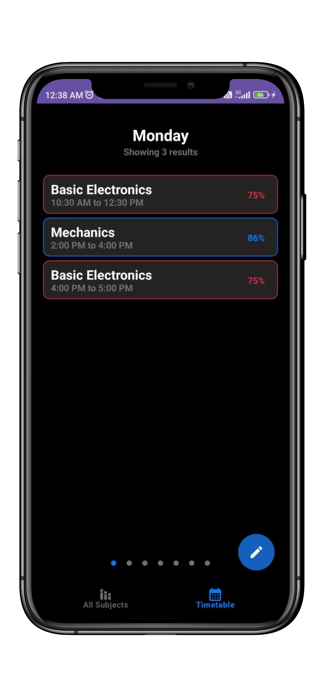
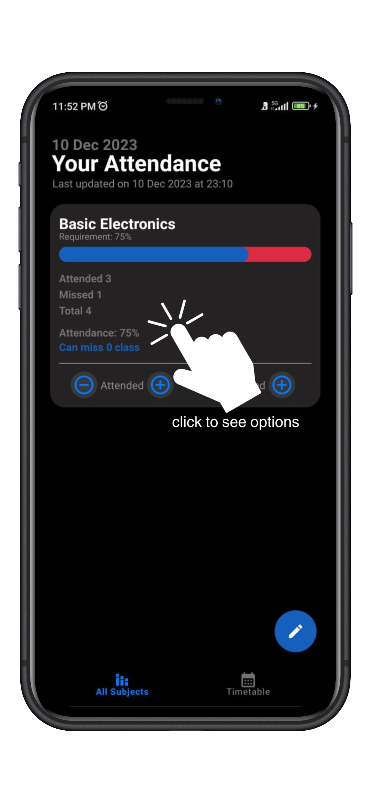
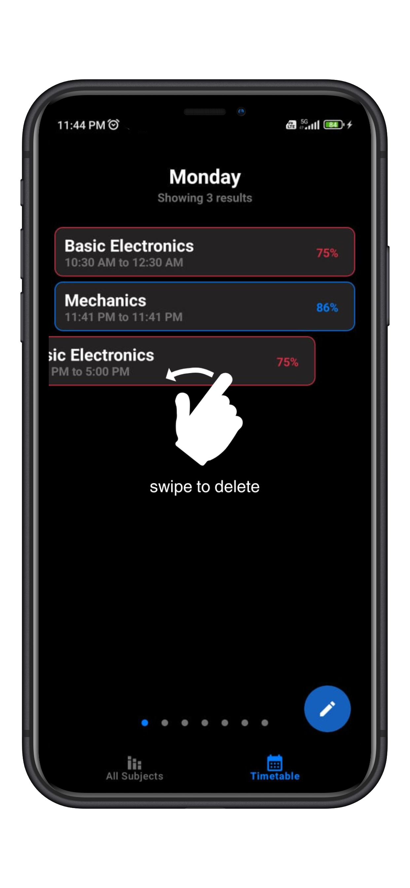

# BunkBuddy
## Overview
Native android application built with Kotlin and XML to keep track of attendance.
## Features
* Track individual subject attendance
* Track lectures
* Get insights on which classes can be bunked.
* User friendly and intuitive UI with scroll gestures like swipe to delete and hold to drag
## Screenshots

## Tech Stack Used
* Kotlin
* XML
* Room Persistence Library
* Coroutines
## Use this application
* Clone this repo and build in android studio
